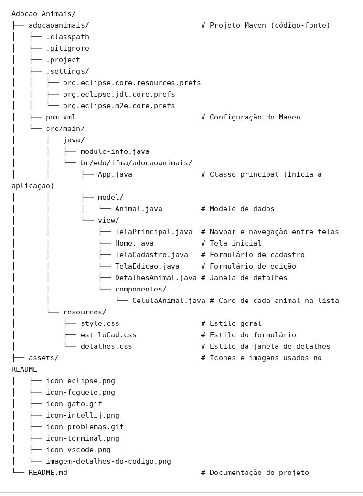
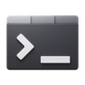

<h1 align="center"> Adoção Pet</h1>
 
Sistema desktop para **gerenciamento de animais disponíveis para adoção**, desenvolvido em **Java com JavaFX**. Com ele é possível cadastrar animais, consultar a lista de todos os cadastrados, ver os detalhes de cada um e remover registros.

---

## 👩‍💻 Integrantes
- Evandro Lucas Cunha Lima
- Júlia Emily Araújo Carvalho
- Keliane Bandeira Barbosa
- Maria de jesus Lima Silva
- Thaísa Venâncio de Sousa
---

## 📋 Descrição do sistema
 
O **Adoção Pet** é uma aplicação de interface gráfica pensada para abrigos, ONGs ou protetores que precisam organizar os animais que aguardam um lar. A aplicação possui navegação por uma barra superior (navbar) com três opções: **Home**, **Animais** e **Cadastrar**.

### Funcionalidades
 
| Funcionalidade | Descrição |
| --- | --- |
| **Home** | Tela de boas-vindas com um botão de acesso rápido à lista de animais. |
| **Listagem de animais** | Exibe todos os animais em cards com nome, espécie, idade, sexo, porte e status (*Disponível* ou *Adotado*), com destaque visual por cor. |
| **Cadastro de animal** | Janela com formulário para informar nome, espécie, idade, sexo, porte e status. |
| **Detalhes do animal** | Ao clicar em um animal da lista, abre uma janela modal com todas as informações dele. |
| **Exclusão** | Botão **Excluir** em cada card para remover o animal da lista. |
| **Edição** | Botão **Editar** em cada card para alterar alguma informação sobre o animal da lista. |

### Dados do animal
 
| Campo | Valores |
| --- | --- |
| Nome | Texto livre |
| Espécie | Cachorro, Gato |
| Faixa Etária | String (em meses/anos) |
| Sexo | Macho, Fêmea |
| Porte | Pequeno, Médio, Grande |
| Status | Disponível, Adotado |

> ⚠️ Ao iniciar, o sistema já carrega dois animais de exemplo (**Rex** e **Luna**). Os dados ficam **apenas em memória**: ao fechar a aplicação, os cadastros feitos durante o uso não são salvos.
 
---

## 🛠️ Tecnologias utilizadas
 
- **Java** 11 ou superior (recomendado JDK 17+)
- **JavaFX 21** (`javafx-controls`)
- **Maven** para gerenciamento de dependências e build
- **CSS** para estilização da interface
- **Visual Studio Code**, **IntelliJ IDEA** ou **Eclipse** como IDE
---

## 📁 Estrutura do projeto

<figure align="center">
  
  <figcaption align="center">Estrutura do Código</figcaption>
</figure>

---
 
## ▶️ Instruções de execução
 
### 1. Pré-requisitos
 
Instale e confirme se estão disponíveis no terminal:
 
- **JDK 17 ou superior** — verifique com:
```bash
  java -version
```
- **Apache Maven** — verifique com:
```bash
  mvn -version
```

### 2. Escolha a sua IDE
 
Antes de tudo, obtenha o projeto de uma das formas abaixo:
 
**Opção A — Clonar pelo Git**
 
```bash
git clone <URL-DO-REPOSITORIO>
cd <NOME-DA-PASTA-CLONADA>
```
 
> Substitua `<URL-DO-REPOSITORIO>` pelo link do repositório (ex.: `https://github.com/usuario/adocaoanimais.git`). É necessário ter o [Git](https://git-scm.com/downloads) instalado — confirme com `git --version`.
 
**Opção B — Extrair o arquivo compactado**
 
Extraia o arquivo `adocaoanimais.rar` em uma pasta de sua preferência.
 
Depois, em qualquer uma das IDEs abaixo, abra a pasta que contém o arquivo **`pom.xml`** (é ela que o Maven reconhece como o projeto).

<h3 align=""> Visual Studio Code</h3>

 
1. Instale as extensões (aba *Extensions* ou `Ctrl+Shift+X`):
   - **Extension Pack for Java** (Microsoft)
   - **Maven for Java** (já vem incluída no pacote acima)
2. Vá em **File → Open Folder** e selecione a pasta que contém o `pom.xml`.
3. Aguarde o VS Code carregar o projeto e baixar as dependências do Maven (o progresso aparece no canto inferior direito).
4. Abra o terminal integrado (`Ctrl+'`) e execute:
```bash
   mvn clean javafx:run
```
 
> 💡 **Alternativa:** abra o arquivo `App.java` e clique em **Run** (▶) acima do método `main`.
> Se ocorrer o erro *"JavaFX runtime components are missing"*, use o comando Maven acima, que já configura o JavaFX automaticamente.

<h3 align=""> IntelliJ IDEA</h3>
 
1. Vá em **File → Open**, selecione o arquivo `pom.xml` (ou a pasta que o contém) e clique em **Open as Project**.
2. Aguarde o IntelliJ importar o projeto e baixar as dependências do Maven. Se aparecer o botão **Load Maven Changes**, clique nele.
3. Configure o JDK em **File → Project Structure → Project → SDK** e escolha o **JDK 17 ou superior** (se não houver nenhum, use **Add SDK → Download JDK**).
4. Para executar, abra a aba **Maven** (lado direito) e siga:
   **adocaoanimais → Plugins → javafx → javafx:run** (clique duas vezes).
> 💡 **Alternativas:**
> - Abra o `App.java` e clique no ícone ▶ ao lado do método `main`.
> - Ou use o terminal do IntelliJ (`Alt+F12`) com o comando `mvn clean javafx:run`.

<h3 align=""> Eclipse</h3>

 
1. Use uma versão do Eclipse com suporte a Maven (ex.: **Eclipse IDE for Java Developers**, que já inclui o Maven Integration for Eclipse, ou m2eclipse).
2. Configure o JDK em **Window → Preferences → Java → Installed JREs**: clique em **Add → Standard VM**, aponte para a pasta do **JDK 17 ou superior** e marque-o como padrão.
3. Importe o projeto em **File → Import → Maven → Existing Maven Projects**, clique em **Browse**, selecione a pasta que contém o `pom.xml` e finalize com **Finish**.
4. Aguarde o download das dependências. Se aparecerem erros de compilação, clique com o botão direito no projeto e vá em **Maven → Update Project** (`Alt+F5`), marcando **Force Update of Snapshots/Releases**.
5. Para executar, clique com o botão direito no projeto e vá em **Run As → Maven build...**. Em **Goals**, digite:
```
   clean javafx:run
```
   e clique em **Run**.
 
> 💡 **Alternativa:** clique com o botão direito em `App.java` e escolha **Run As → Java Application**.
> Se aparecer o erro *"JavaFX runtime components are missing"*, use o **Maven build** descrito acima.


<h3 align=""> Pelo terminal (qualquer sistema)</h3>

Dentro da pasta que contém o `pom.xml`, execute:
 
```bash
mvn clean javafx:run
```
 
A janela **Adoção Pet** será aberta.

<h3 align=""> Solução de problemas</h3>

 
| Problema | Solução |
| --- | --- |
| `mvn` não é reconhecido | Instale o Maven e adicione a pasta `bin` dele à variável de ambiente `PATH`. |
| Erro de versão do Java | Confirme com `java -version` que está usando JDK 17 ou superior. |
| Dependências não baixam | Verifique a conexão com a internet e execute `mvn clean install`. |
| Janela não abre pelo botão Run | Use `mvn clean javafx:run` (terminal ou Maven build da IDE). |
| IntelliJ/Eclipse usando Java antigo | Configure o JDK 17+ em *Project Structure* (IntelliJ) ou *Installed JREs* (Eclipse). |
| Eclipse com erros vermelhos após importar | Clique com o botão direito no projeto → **Maven → Update Project** (`Alt+F5`). |

---
 

<h3 align=""> Como usar</h3>
 
1. Na **Home**, clique em **Ver animais disponíveis** (ou em **Animais** na barra superior) para ver a lista.
2. Clique em **Cadastrar** na barra superior, preencha o formulário e clique em **Salvar** — o animal aparece na lista.
3. Clique sobre um animal da lista para abrir a janela com os **detalhes**.
4. Use o botão **Excluir** para remover um animal.
---
 
## 📌 Possíveis melhorias futuras
 
- Persistência dos dados (arquivo ou banco de dados)
- Validação dos campos do formulário (ex.: idade não numérica)
- Edição de animais já cadastrados
- Filtros e busca por espécie, porte ou status
- Inclusão de fotos dos animais
---
 
## 📄 Licença
 
Projeto desenvolvido para fins acadêmicos.